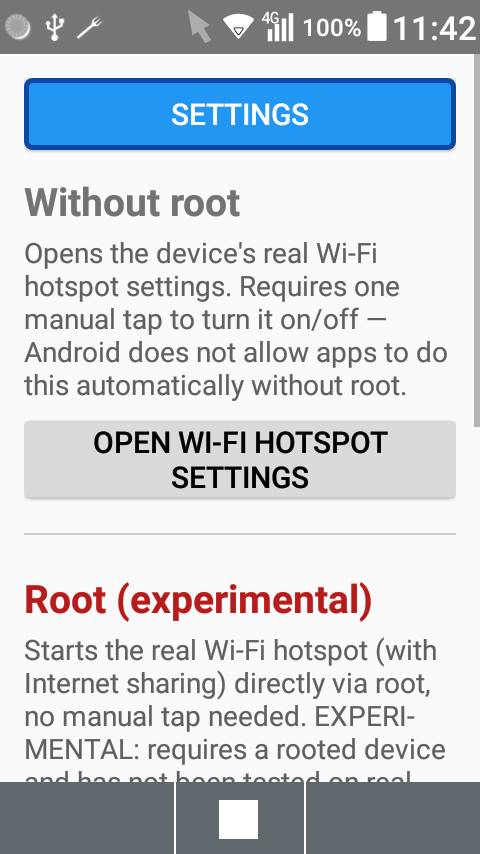
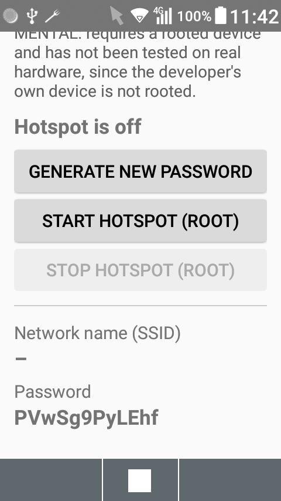
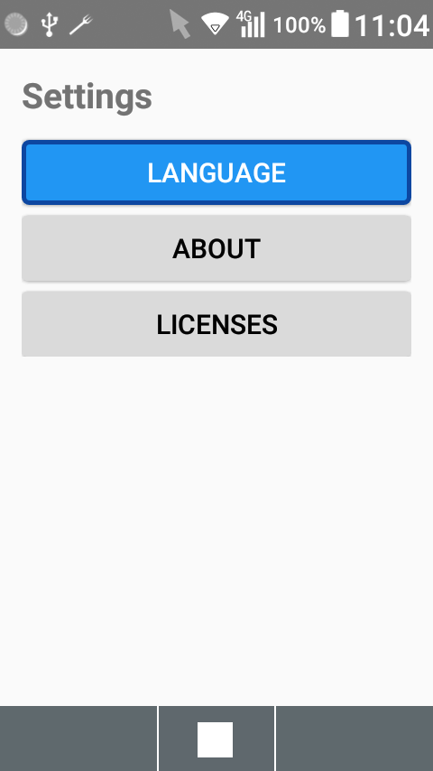

# KeitaiHotspot

Android app for controlling the real Wi-Fi hotspot (with Internet sharing) —
built for flip phones with physical keys and a D-Pad (no touchscreen needed).

The app is split into two sections, because Android does not let regular
apps control the real Internet-sharing hotspot without root:

- **Without root** — opens the device's real hotspot settings directly, so
  you only need to tap the on/off switch yourself (no menu digging). This
  also works around vendors that hide the hotspot screen from the normal
  Settings menu entirely — as Kyocera does on the developer's own device
  (see [Why two sections?](#why-two-sections)).
- **Root (experimental)** — starts/stops the real hotspot directly via root,
  no manual tap needed. Untested on real hardware, since the developer's own
  device is not rooted.

## Why two sections?

Since Android 8, third-party apps can only create a
["local-only" Wi-Fi hotspot](https://developer.android.com/reference/android/net/wifi/WifiManager#startLocalOnlyHotspot(android.net.wifi.WifiManager.LocalOnlyHotspotCallback,android.os.Handler))
that does **not** share Internet access — that's an intentional Android
platform restriction, not a bug. The *real* hotspot (the one that shares your
mobile data) can only be toggled by apps holding the signature-level
`NETWORK_STACK`/`TETHER_PRIVILEGED` permission, which is reserved for
system/root-privileged processes. See [`RootHotspotHelper.kt`](app/src/main/java/de/mogeldev/keitaihotspot/RootHotspotHelper.kt)
for the exact `cmd wifi start-softap`/`stop-softap` shell syntax (sourced
from the [AOSP `WifiShellCommand.java`](https://android.googlesource.com/platform/packages/modules/Wifi/+/refs/heads/main/service/java/com/android/server/wifi/WifiShellCommand.java)),
which explicitly requires UID 0 (root).

## Features

- **Without root:** one-tap shortcut to the device's real hotspot settings
- **Root (experimental):** direct start/stop of the real hotspot, custom
  password generation, QR code for quick connecting
- Fully navigable with a D-Pad
- Multilingual: English, Deutsch, Japanese (selectable manually in Settings)

## Screenshots

<table>
<tr>
<td></td>
<td></td>
<td></td>
</tr>
<tr>
<td align="center">Main screen</td>
<td align="center">Root section</td>
<td align="center">Settings</td>
</tr>
</table>

## Requirements

- [Android Studio](https://developer.android.com/studio) (latest version)
- JDK 17
- Android SDK Platform **26** and Build Tools (installed automatically via the
  SDK Manager the first time the project is opened, if not already present)
- A device running Android 8.0 (API 26) or later, with USB debugging enabled
- For the root section to actually work: a **rooted** device with a working
  `su` binary (e.g. Magisk)

## Setup

```bash
git clone https://github.com/mogeldev/keitaihotspot.git
cd keitaihotspot
```

1. Open the project in Android Studio (**File → Open**, select the
   `keitaihotspot` folder).
2. Wait for the Gradle sync to finish (automatically downloads any missing SDK
   components if needed).
3. Connect a device via USB and confirm **"Allow USB debugging"** on the popup.
4. Click **Run ▶** to install and launch the app on the device.

### Building from the command line

```bash
./gradlew assembleDebug
```

The resulting APK is at `app/build/outputs/apk/debug/app-debug.apk`.

### Installing manually (ADB)

```bash
adb install -r app/build/outputs/apk/debug/app-debug.apk
```

## Tech Stack

- Kotlin, classic Android Views (no Jetpack Compose) for reliable D-Pad
  navigation
- ViewBinding
- [ZXing](https://github.com/zxing/zxing) for offline QR code generation

## License

KeitaiHotspot Copyright (C) 2026 mogeldev

This program is free software: you can redistribute it and/or modify it under
the terms of the [GNU General Public License Version 3](LICENSE) (or, at your
option, any later version).

It is distributed in the hope that it will be useful, but WITHOUT ANY
WARRANTY — see the [LICENSE](LICENSE) file for details.

Third-party open-source libraries used and their licenses are listed in
[THIRD_PARTY_LICENSES.md](THIRD_PARTY_LICENSES.md).

## About

Developed by [mogeldev](https://mogeldev.github.io) ([mogeldev.de](https://mogeldev.de)).
